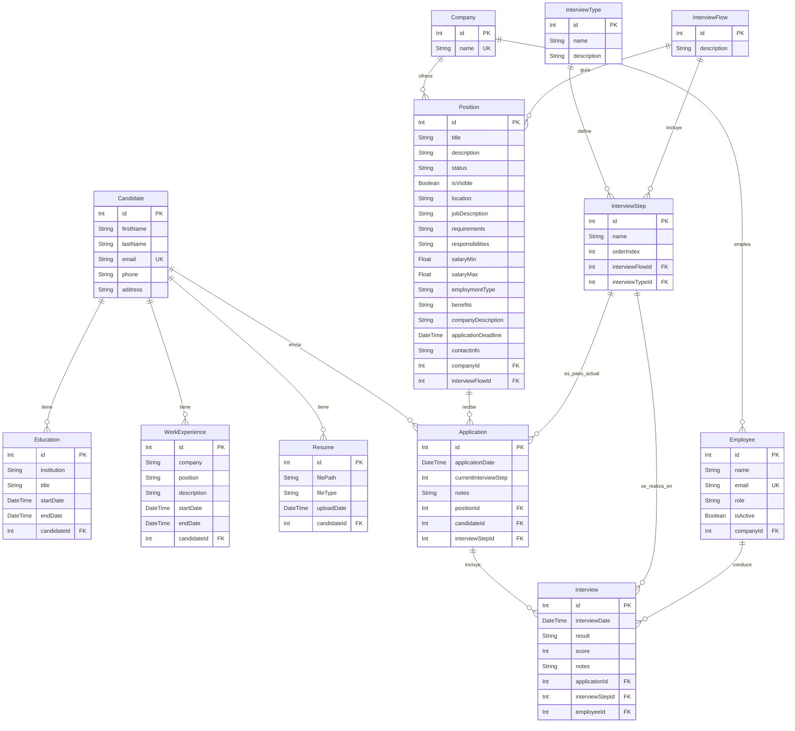

# Documentación del Modelo de Datos

Este documento describe el modelo de datos para la aplicación LTI (Learning Technology Initiative), incluyendo descripciones de entidades, definiciones de campos, relaciones y un diagrama entidad-relación.

## Descripciones de los Modelos

### 1. Candidate (Candidato)
Representa a un candidato que puede aplicar a posiciones laborales dentro del sistema.

**Campos:**
- `id`: Identificador único del candidato (Clave Primaria).
- `firstName`: Nombre del candidato (máximo 100 caracteres).
- `lastName`: Apellido del candidato (máximo 100 caracteres).
- `email`: Dirección de correo electrónico única del candidato (máximo 255 caracteres).
- `phone`: Número de teléfono del candidato (opcional, máximo 15 caracteres).
- `address`: Dirección del candidato (opcional, máximo 100 caracteres).

**Reglas de Validación:**
- El nombre y apellido son obligatorios (2-100 caracteres, solo letras).
- El email es obligatorio, debe ser único y tener un formato de email válido.
- El teléfono es opcional, pero si se proporciona, debe seguir un formato válido.
- La dirección es opcional (máximo 100 caracteres).
- Máximo de 3 registros de educación por candidato.

**Relaciones:**
- `educations`: Relación uno-a-muchos con el modelo `Education`.
- `workExperiences`: Relación uno-a-muchos con el modelo `WorkExperience`.
- `resumes`: Relación uno-a-muchos con el modelo `Resume`.
- `applications`: Relación uno-a-muchos con el modelo `Application`.

### 2. Education (Educación)
Representa el historial educativo de un candidato.

**Campos:**
- `id`: Identificador único del registro educativo (Clave Primaria).
- `institution`: Nombre de la institución educativa (máximo 100 caracteres).
- `title`: Título del grado o certificación obtenida (máximo 250 caracteres).
- `startDate`: Fecha de inicio del período educativo.
- `endDate`: Fecha de finalización (opcional, nulo si está en curso).
- `candidateId`: Clave foránea que referencia a `Candidate`.

**Reglas de Validación:**
- `institution` y `title` son obligatorios.
- `startDate` es obligatoria.
- `endDate` debe ser una fecha válida si se proporciona.
- Máximo de 3 registros de educación por candidato.

**Relaciones:**
- `candidate`: Relación muchos-a-uno con el modelo `Candidate`.

### 3. WorkExperience (Experiencia Laboral)
Representa el historial laboral de un candidato.

**Campos:**
- `id`: Identificador único del registro (Clave Primaria).
- `company`: Nombre de la empresa (máximo 100 caracteres).
- `position`: Título del puesto ocupado (máximo 100 caracteres).
- `description`: Descripción de responsabilidades (opcional, máximo 200 caracteres).
- `startDate`: Fecha de inicio.
- `endDate`: Fecha de finalización (opcional, nulo si es actual).
- `candidateId`: Clave foránea que referencia a `Candidate`.

**Reglas de Validación:**
- `company` y `position` son obligatorios.
- `startDate` es obligatoria.
- `endDate` debe ser una fecha válida si se proporciona.

**Relaciones:**
- `candidate`: Relación muchos-a-uno con el modelo `Candidate`.

### 4. Resume (Currículum)
Representa los archivos de currículum vitae de los candidatos.

**Campos:**
- `id`: Identificador único del registro (Clave Primaria).
- `filePath`: Ruta del archivo subido (máximo 500 caracteres).
- `fileType`: Tipo MIME del archivo (máximo 50 caracteres).
- `uploadDate`: Fecha y hora de subida del archivo.
- `candidateId`: Clave foránea que referencia a `Candidate`.

**Reglas de Validación:**
- `filePath` y `fileType` son obligatorios.
- `uploadDate` se establece automáticamente.
- Tipos de archivo soportados: PDF, DOCX (máximo 10MB).

**Relaciones:**
- `candidate`: Relación muchos-a-uno con el modelo `Candidate`.

### 5. Company (Empresa)
Representa a una empresa que publica posiciones.

**Campos:**
- `id`: Identificador único de la empresa (Clave Primaria).
- `name`: Nombre único de la empresa.

**Relaciones:**
- `employees`: Relación uno-a-muchos con el modelo `Employee`.
- `positions`: Relación uno-a-muchos con el modelo `Position`.

### 6. Employee (Empleado)
Representa a un empleado de una empresa, generalmente un entrevistador.

**Campos:**
- `id`: Identificador único del empleado (Clave Primaria).
- `name`: Nombre completo del empleado.
- `email`: Dirección de correo electrónico única.
- `role`: Rol o título del puesto.
- `isActive`: Booleano que indica si el empleado está activo.
- `companyId`: Clave foránea que referencia a `Company`.

**Relaciones:**
- `company`: Relación muchos-a-uno con `Company`.
- `interviews`: Relación uno-a-muchos con `Interview`.

### 7. InterviewType (Tipo de Entrevista)
Define los diferentes tipos de entrevistas (ej. "Técnica", "RRHH").

**Campos:**
- `id`: Identificador único del tipo (Clave Primaria).
- `name`: Nombre del tipo de entrevista.
- `description`: Descripción detallada (opcional).

**Relaciones:**
- `interviewSteps`: Relación uno-a-muchos con `InterviewStep`.

### 8. InterviewFlow (Flujo de Entrevista)
Representa la secuencia de pasos de entrevista para un proceso de contratación.

**Campos:**
- `id`: Identificador único del flujo (Clave Primaria).
- `description`: Descripción del proceso (opcional).

**Relaciones:**
- `interviewSteps`: Relación uno-a-muchos con `InterviewStep`.
- `positions`: Relación uno-a-muchos con `Position`.

### 9. InterviewStep (Paso de Entrevista)
Representa un paso individual dentro de un `InterviewFlow`.

**Campos:**
- `id`: Identificador único del paso (Clave Primaria).
- `name`: Nombre del paso.
- `orderIndex`: Orden numérico de este paso dentro del flujo.
- `interviewFlowId`: Clave foránea que referencia a `InterviewFlow`.
- `interviewTypeId`: Clave foránea que referencia a `InterviewType`.

**Relaciones:**
- `interviewFlow`: Relación muchos-a-uno con `InterviewFlow`.
- `interviewType`: Relación muchos-a-uno con `InterviewType`.
- `applications`: Relación uno-a-muchos con `Application`.
- `interviews`: Relación uno-a-muchos con `Interview`.

### 10. Position (Posición)
Representa una posición laboral disponible.

**Campos:**
- `id`: Identificador único de la posición (Clave Primaria).
- `companyId`: Clave foránea que referencia a `Company` (obligatorio).
- `interviewFlowId`: Clave foránea que referencia a `InterviewFlow` (obligatorio).
- `title`: Título del puesto (obligatorio, máximo 100 caracteres).
- `description`: Breve descripción de la posición (obligatorio).
- `status`: Estado actual (`Draft`, `Open`, `Hired`, `Closed`).
- `isVisible`: Booleano que indica si la posición es públicamente visible.
- `location`: Ubicación del trabajo (obligatorio).
- `jobDescription`: Descripción detallada del trabajo (obligatorio).
- `requirements`: Requisitos y calificaciones (opcional).
- `responsibilities`: Responsabilidades del puesto (opcional).
- `salaryMin`: Rango mínimo de salario (opcional, >= 0).
- `salaryMax`: Rango máximo de salario (opcional, >= 0 y >= salaryMin).
- `employmentType`: Tipo de empleo (ej. "Full-time", "Part-time") (opcional).
- `benefits`: Beneficios del puesto (opcional).
- `companyDescription`: Descripción de la empresa contratante (opcional).
- `applicationDeadline`: Fecha límite para aplicaciones (opcional, fecha futura).
- `contactInfo`: Información de contacto (opcional).

**Relaciones:**
- `company`: Relación muchos-a-uno con `Company`.
- `interviewFlow`: Relación muchos-a-uno con `InterviewFlow`.
- `applications`: Relación uno-a-muchos con `Application`.

### 11. Application (Aplicación)
Representa la aplicación de un candidato a una posición.

**Campos:**
- `id`: Identificador único de la aplicación (Clave Primaria).
- `applicationDate`: Fecha de envío de la aplicación.
- `currentInterviewStep`: Paso actual en el proceso de entrevista.
- `notes`: Notas adicionales sobre la aplicación (opcional).
- `positionId`: Clave foránea que referencia a `Position`.
- `candidateId`: Clave foránea que referencia a `Candidate`.
- `interviewStepId`: Clave foránea que referencia al `InterviewStep` actual.

**Relaciones:**
- `position`: Relación muchos-a-uno con `Position`.
- `candidate`: Relación muchos-a-uno con `Candidate`.
- `interviewStep`: Relación muchos-a-uno con `InterviewStep`.
- `interviews`: Relación uno-a-muchos con `Interview`.

### 12. Interview (Entrevista)
Representa una sesión de entrevista individual.

**Campos:**
- `id`: Identificador único de la entrevista (Clave Primaria).
- `interviewDate`: Fecha y hora de la entrevista.
- `result`: Resultado de la entrevista (opcional).
- `score`: Puntuación numérica de la entrevista (opcional).
- `notes`: Notas y retroalimentación (opcional).
- `applicationId`: Clave foránea que referencia a `Application`.
- `interviewStepId`: Clave foránea que referencia a `InterviewStep`.
- `employeeId`: Clave foránea que referencia al `Employee` que conduce la entrevista.

**Relaciones:**
- `application`: Relación muchos-a-uno con `Application`.
- `interviewStep`: Relación muchos-a-uno con `InterviewStep`.
- `employee`: Relación muchos-a-uno con `Employee`.

## Diagrama Entidad-Relación

## Principios Clave de Diseño

1.  **Integridad Referencial**: Las claves foráneas aseguran la consistencia de los datos en todo el sistema.
2.  **Flexibilidad**: El sistema de flujos de entrevista permite procesos de contratación personalizables por posición.
3.  **Auditoría**: Las fechas de aplicación y entrevista proporcionan una línea de tiempo del proceso.
4.  **Extensibilidad**: El diseño modular facilita la adición de nuevas funcionalidades.
5.  **Normalización**: El modelo sigue principios de normalización para minimizar la redundancia y asegurar la integridad de los datos.

## Notas

- Los campos `id` son claves primarias autoincrementales.
- Las relaciones con claves foráneas mantienen la integridad referencial.
- Los campos opcionales permiten flexibilidad en la entrada de datos.
- Los emails tienen restricciones de unicidad para prevenir cuentas duplicadas.
