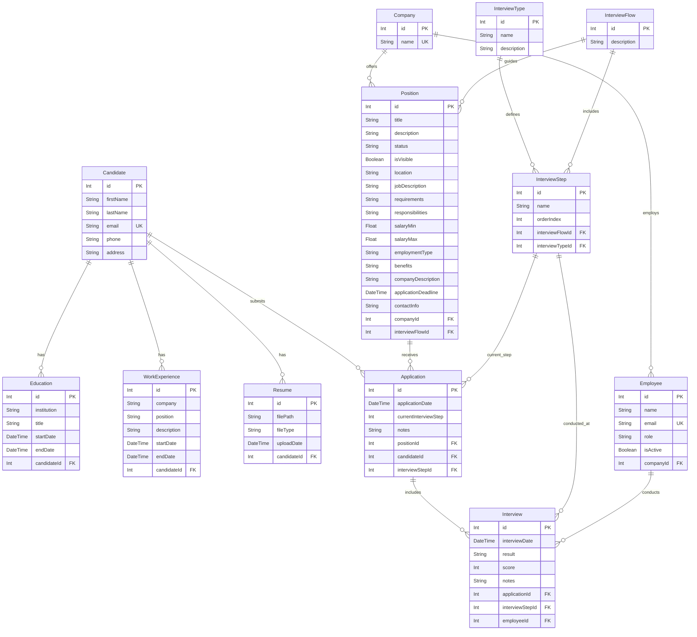

# Documentación del Modelo de Datos

Este documento describe el modelo de datos para la aplicación LTI (Learning Tracking Initiative), incluyendo descripciones de entidades, definiciones de campos, relaciones y un diagrama entidad-relación.

## Descripciones de los Modelos

### 1. Candidate
Representa un candidato a empleo que puede aplicar a posiciones dentro del sistema.

**Campos:**
- `id`: Identificador único del candidato (Clave Primaria)
- `firstName`: Nombre del candidato (máximo 100 caracteres)
- `lastName`: Apellido del candidato (máximo 100 caracteres)
- `email`: Dirección de correo electrónico única del candidato (máximo 255 caracteres)
- `phone`: Número de teléfono del candidato (opcional, máximo 15 caracteres)
- `address`: Dirección del candidato (opcional, máximo 100 caracteres)

**Reglas de Validación:**
- El nombre y apellido son obligatorios, de 2-100 caracteres, solo letras
- El email es obligatorio, debe ser único y seguir un formato de email válido
- El teléfono es opcional pero debe seguir el formato español (6|7|9)XXXXXXXX si se proporciona
- La dirección es opcional pero no puede exceder los 100 caracteres
- Máximo de 3 registros de educación por candidato

**Relaciones:**
- `educations`: Relación uno-a-muchos con el modelo Education
- `workExperiences`: Relación uno-a-muchos con el modelo WorkExperience
- `resumes`: Relación uno-a-muchos con el modelo Resume
- `applications`: Relación uno-a-muchos con el modelo Application

### 2. Education
Representa información del historial educativo de los candidatos.

**Campos:**
- `id`: Identificador único del registro educativo (Clave Primaria)
- `institution`: Nombre de la institución educativa (máximo 100 caracteres)
- `title`: Título del grado o certificación obtenida (máximo 250 caracteres)
- `startDate`: Fecha de inicio del período educativo
- `endDate`: Fecha de finalización del período educativo (opcional, null si está en curso)
- `candidateId`: Clave foránea que referencia al Candidate

**Reglas de Validación:**
- La institución es obligatoria y no puede exceder los 100 caracteres
- El título es obligatorio y no puede exceder los 250 caracteres
- La fecha de inicio es obligatoria y debe estar en formato de fecha válido
- La fecha de finalización es opcional pero debe ser válida si se proporciona
- Máximo de 3 registros de educación por candidato

**Relaciones:**
- `candidate`: Relación muchos-a-uno con el modelo Candidate

### 3. WorkExperience
Representa el historial laboral y experiencia profesional de los candidatos.

**Campos:**
- `id`: Identificador único del registro de experiencia laboral (Clave Primaria)
- `company`: Nombre de la empresa u organización (máximo 100 caracteres)
- `position`: Título del puesto o posición ocupada (máximo 100 caracteres)
- `description`: Descripción de responsabilidades y logros (opcional, máximo 200 caracteres)
- `startDate`: Fecha de inicio de la experiencia laboral
- `endDate`: Fecha de finalización de la experiencia laboral (opcional, null si es actual)
- `candidateId`: Clave foránea que referencia al Candidate

**Reglas de Validación:**
- El nombre de la empresa es obligatorio y no puede exceder los 100 caracteres
- La posición es obligatoria y no puede exceder los 100 caracteres
- La descripción es opcional pero no puede exceder los 200 caracteres si se proporciona
- La fecha de inicio es obligatoria y debe estar en formato de fecha válido
- La fecha de finalización es opcional pero debe ser válida si se proporciona

**Relaciones:**
- `candidate`: Relación muchos-a-uno con el modelo Candidate

### 4. Resume
Representa archivos de currículum vitae subidos asociados con candidatos.

**Campos:**
- `id`: Identificador único del registro de currículum (Clave Primaria)
- `filePath`: Ruta del sistema de archivos al currículum subido (máximo 500 caracteres)
- `fileType`: Tipo MIME o extensión del archivo del currículum (máximo 50 caracteres)
- `uploadDate`: Fecha y hora en que el currículum fue subido
- `candidateId`: Clave foránea que referencia al Candidate

**Reglas de Validación:**
- La ruta del archivo es obligatoria y no puede exceder los 500 caracteres
- El tipo de archivo es obligatorio y no puede exceder los 50 caracteres
- La fecha de subida se establece automáticamente cuando se sube el archivo
- Tipos de archivo soportados: PDF y DOCX (máximo 10MB)

**Relaciones:**
- `candidate`: Relación muchos-a-uno con el modelo Candidate

### 5. Company
Representa empresas que publican posiciones de trabajo y emplean personal.

**Campos:**
- `id`: Identificador único de la empresa (Clave Primaria)
- `name`: Nombre único de la empresa

**Relaciones:**
- `employees`: Relación uno-a-muchos con el modelo Employee
- `positions`: Relación uno-a-muchos con el modelo Position

### 6. Employee
Representa empleados dentro de empresas que pueden conducir entrevistas.

**Campos:**
- `id`: Identificador único del empleado (Clave Primaria)
- `name`: Nombre completo del empleado
- `email`: Dirección de correo electrónico única del empleado
- `role`: Rol o título del puesto del empleado
- `isActive`: Booleano que indica si el empleado está actualmente activo
- `companyId`: Clave foránea que referencia a la Company

**Relaciones:**
- `company`: Relación muchos-a-uno con el modelo Company
- `interviews`: Relación uno-a-muchos con el modelo Interview

### 7. InterviewType
Define diferentes tipos de entrevistas que pueden ser conducidas.

**Campos:**
- `id`: Identificador único del tipo de entrevista (Clave Primaria)
- `name`: Nombre del tipo de entrevista (ej., "Technical", "HR", "Behavioral")
- `description`: Descripción detallada del tipo de entrevista (opcional)

**Relaciones:**
- `interviewSteps`: Relación uno-a-muchos con el modelo InterviewStep

### 8. InterviewFlow
Representa una secuencia de pasos de entrevista que definen el proceso de contratación.

**Campos:**
- `id`: Identificador único del flujo de entrevista (Clave Primaria)
- `description`: Descripción del proceso del flujo de entrevista (opcional)

**Relaciones:**
- `interviewSteps`: Relación uno-a-muchos con el modelo InterviewStep
- `positions`: Relación uno-a-muchos con el modelo Position

### 9. InterviewStep
Representa pasos individuales dentro de un flujo de entrevista.

**Campos:**
- `id`: Identificador único del paso de entrevista (Clave Primaria)
- `name`: Nombre del paso de entrevista
- `orderIndex`: Orden numérico de este paso dentro del flujo
- `interviewFlowId`: Clave foránea que referencia al InterviewFlow
- `interviewTypeId`: Clave foránea que referencia al InterviewType

**Relaciones:**
- `interviewFlow`: Relación muchos-a-uno con el modelo InterviewFlow
- `interviewType`: Relación muchos-a-uno con el modelo InterviewType
- `applications`: Relación uno-a-muchos con el modelo Application
- `interviews`: Relación uno-a-muchos con el modelo Interview

### 10. Position
Representa posiciones de trabajo disponibles para aplicación.

**Campos:**
- `id`: Identificador único de la posición (Clave Primaria)
- `companyId`: Clave foránea que referencia a la Company (obligatorio)
- `interviewFlowId`: Clave foránea que referencia al InterviewFlow (obligatorio)
- `title`: Título del puesto (obligatorio, máximo 100 caracteres)
- `description`: Breve descripción de la posición (obligatorio)
- `status`: Estado actual de la posición (predeterminado: "Draft", valores válidos: Open, Contratado, Cerrado, Borrador)
- `isVisible`: Booleano que indica si la posición es públicamente visible (predeterminado: false)
- `location`: Ubicación del trabajo (obligatorio)
- `jobDescription`: Descripción detallada del trabajo (obligatorio)
- `requirements`: Requisitos y calificaciones del trabajo (opcional)
- `responsibilities`: Responsabilidades del trabajo (opcional)
- `salaryMin`: Rango mínimo de salario (opcional, debe ser >= 0)
- `salaryMax`: Rango máximo de salario (opcional, debe ser >= 0 y >= salaryMin)
- `employmentType`: Tipo de empleo (ej., "Full-time", "Part-time", "Contract") (opcional)
- `benefits`: Descripción de beneficios del trabajo (opcional)
- `companyDescription`: Descripción de la empresa contratante (opcional)
- `applicationDeadline`: Fecha límite para aplicaciones (opcional, debe ser una fecha futura)
- `contactInfo`: Información de contacto para consultas (opcional)

**Reglas de Validación:**
- El título es obligatorio y no puede exceder los 100 caracteres
- La descripción, ubicación y jobDescription son campos obligatorios
- El estado debe ser uno de: Open, Contratado, Cerrado, Borrador
- Las referencias a empresa y flujo de entrevista deben existir en la base de datos
- Los valores de salario deben ser números no negativos
- La fecha límite de aplicación debe ser una fecha futura si se proporciona

**Relaciones:**
- `company`: Relación muchos-a-uno con el modelo Company
- `interviewFlow`: Relación muchos-a-uno con el modelo InterviewFlow
- `applications`: Relación uno-a-muchos con el modelo Application

### 11. Application
Representa la aplicación de un candidato a una posición específica.

**Campos:**
- `id`: Identificador único de la aplicación (Clave Primaria)
- `applicationDate`: Fecha en que la aplicación fue enviada
- `currentInterviewStep`: Paso actual en el proceso de entrevista
- `notes`: Notas adicionales sobre la aplicación (opcional)
- `positionId`: Clave foránea que referencia a la Position
- `candidateId`: Clave foránea que referencia al Candidate
- `interviewStepId`: Clave foránea que referencia al InterviewStep actual

**Relaciones:**
- `position`: Relación muchos-a-uno con el modelo Position
- `candidate`: Relación muchos-a-uno con el modelo Candidate
- `interviewStep`: Relación muchos-a-uno con el modelo InterviewStep
- `interviews`: Relación uno-a-muchos con el modelo Interview

### 12. Interview
Representa sesiones individuales de entrevista conducidas como parte de una aplicación.

**Campos:**
- `id`: Identificador único de la entrevista (Clave Primaria)
- `interviewDate`: Fecha y hora de la entrevista
- `result`: Resultado o desenlace de la entrevista (opcional)
- `score`: Puntuación numérica o calificación de la entrevista (opcional)
- `notes`: Notas y retroalimentación de la entrevista (opcional)
- `applicationId`: Clave foránea que referencia a la Application
- `interviewStepId`: Clave foránea que referencia al InterviewStep
- `employeeId`: Clave foránea que referencia al Employee que conduce la entrevista

**Relaciones:**
- `application`: Relación muchos-a-uno con el modelo Application
- `interviewStep`: Relación muchos-a-uno con el modelo InterviewStep
- `employee`: Relación muchos-a-uno con el modelo Employee

## Diagrama Entidad-Relación

## Principios Clave de Diseño

1. **Integridad Referencial**: Todas las relaciones de claves foráneas aseguran la consistencia de datos a través del sistema.

2. **Flexibilidad**: El sistema de flujo de entrevistas permite procesos de contratación personalizables por posición.

3. **Registro de Auditoría**: Las fechas de aplicación y entrevista proporcionan una línea de tiempo completa del proceso de contratación.

4. **Extensibilidad**: El diseño modular permite la fácil adición de nuevas características y puntos de datos.

5. **Normalización de Datos**: El modelo sigue principios de normalización de bases de datos para minimizar la redundancia y asegurar la integridad de datos.

## Notas

- Todos los campos `id` sirven como claves primarias con funcionalidad de auto-incremento
- Las relaciones de claves foráneas mantienen la integridad referencial
- Los campos opcionales permiten la entrada flexible de datos mientras se mantiene la información central requerida
- El sistema de entrevistas soporta procesos de contratación de múltiples pasos con diferentes tipos de entrevistas
- Los campos de email tienen restricciones únicas para prevenir cuentas duplicadas
